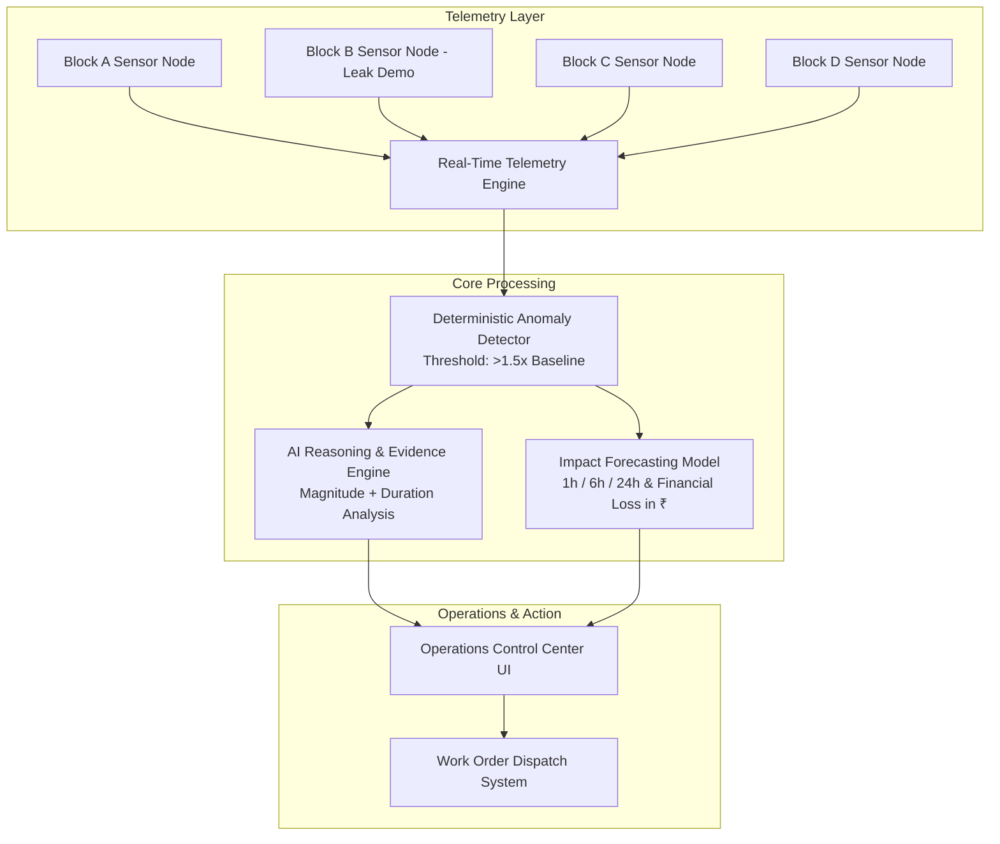

# AquaSentinel 🌊
> **"AI that detects water waste before it becomes a bill."**

AquaSentinel is an AI-powered water intelligence and response platform designed for hostels, apartments, commercial towers, and university campuses. It continuously monitors water telemetry, detects anomalous consumption patterns using a statistical baseline model, generates structured AI diagnostic explanations, forecasts projected volumetric & financial loss in INR (₹), and automatically dispatches maintenance work orders.

---

## 📌 Problem Statement

Water waste in high-density residential and commercial facilities often goes unnoticed for days or weeks:
- **Hidden pipe bursts**: Sub-surface and wall leaks dumping thousands of liters continuously.
- **Tank overflows**: Valve failures causing overhead reservoirs to overflow.
- **Off-peak continuous flow**: Unattended fixtures running during 2 AM – 5 AM quiet windows.
- **Delayed awareness**: Facilities usually discover leaks only after receiving a massive municipal water bill.

---

## 💡 AquaSentinel Solution

AquaSentinel automates the entire lifecycle of water management through a 5-step intelligence loop:

```
MONITOR  →  DETECT  →  EXPLAIN  →  PREDICT  →  ACT
```

1. **MONITOR**: Real-time telemetry sampling of flow rate (L/min), supply pressure (bar), tank level (%), and water temperature.
2. **DETECT**: Deterministic 1.5× baseline anomaly threshold evaluation (e.g. 64.5 L/min for a 43 L/min expected baseline).
3. **EXPLAIN**: Natural-language root cause diagnostic reasoning with a **"WHY NOW?"** Evidence Timeline (Magnitude + Duration).
4. **PREDICT**: Mathematical projected water loss (15 min simulated: 765 L | 6h: 18,360 L | 24h: 73,440 L) and financial cost in Indian Rupees (₹826.20 / 6h).
5. **ACT**: One-click automated maintenance ticket dispatch with location, severity, and assigned technician.

---

## 🏗️ Architecture & Data Flow



*Note: Production architecture supports ESP32 / Modbus / MQTT hardware telemetry streams.*

---

## 🛠️ Tech Stack

- **Frontend**: React 18, TypeScript, Tailwind CSS
- **Charts**: Recharts (Dynamic dual area/line graphs)
- **Icons**: Lucide React
- **Design System**: Industrial Water Operations Dark Theme (`#090d16` slate theme)
- **Architecture**: Modular Telemetry Service layer with standalone zero-crash fallback engine.

---

## 📐 Anomaly Detection & Impact Formulas

### 1. Deterministic Anomaly Threshold
$$\text{Threshold} = \text{Baseline Flow} \times 1.5 = 43 \text{ L/min} \times 1.5 = 64.5 \text{ L/min}$$
- **Normal Flow** ($\le 55 \text{ L/min}$): System normal ($0 \text{ L}$ projected loss, $\text{\rupee}0.00$)
- **Elevated Flow** ($55 - 64.5 \text{ L/min}$): Elevated variance warning
- **Critical Anomaly** ($> 64.5 \text{ L/min}$): Critical leak alert triggered

### 2. Projected Water Loss Formula
$$\text{Excess Flow} = \max(0, \text{Current Flow} - \text{Baseline Flow}) = 94 - 43 = 51 \text{ L/min}$$
$$\text{Loss}_{15m} = 51 \times 15 = 765 \text{ L (15 min simulated)}$$
$$\text{Loss}_{6h} = 51 \times 360 = 18,360 \text{ L}$$
$$\text{Loss}_{24h} = 51 \times 1440 = 73,440 \text{ L}$$

### 3. Financial Loss Formula (INR)
$$\text{Financial Loss}_{6h} = \left( \frac{\text{Loss}_{6h}}{1000} \right) \times \text{Water Rate (\rupee/kL)} = \left( \frac{18,360}{1000} \right) \times 45 = \text{\rupee}826.20$$

---

## 🚦 Quick Start & Installation

### Prerequisites
- **Node.js** v18+ and **npm** v9+

### 1. Clone & Install
```bash
git clone <your-repository-url>
cd aquasentinel
npm install
```

### 2. Start Development Server
```bash
npm run dev
```
Open [http://localhost:3000](http://localhost:3000) in your browser.

### 3. Build for Production
```bash
npm run build
npm run preview
```

---

## 🎮 Hackathon Presentation Script (2-Minute Demo)

1. **Overview**: Open [http://localhost:3000](http://localhost:3000). Show normal telemetry (~43 L/min).
2. **Simulate Leak**: Click `[ SIMULATE LEAK ]` on the control toolbar. Watch telemetry ramp dynamically (**43 → 44 → 61 → 78 → 94 L/min**).
3. **Evidence Timeline**: Highlight the **"WHY NOW?"** card showing magnitude + duration evaluation.
4. **AI Reasoning**: Review root cause analysis (*Continuous pipe leak*) and recommended action (*Inspect Block B — Floor 2*).
5. **Projected Impact**: Show volumetric loss (**18,360 L / 6h**) and financial impact (**₹826.20**).
6. **Work Order Dispatch**: Click `[ CREATE WORK ORDER ]` → generate **Ticket #104** → view in Work Orders tab.
7. **Reset**: Click `[ RESET ]` → live stream returns to normal while preserving Ticket #104 in history.

---

## 📜 License
Open Innovation Hackathon Prototype — Created with ❤️ for smarter, leak-free building infrastructure.
